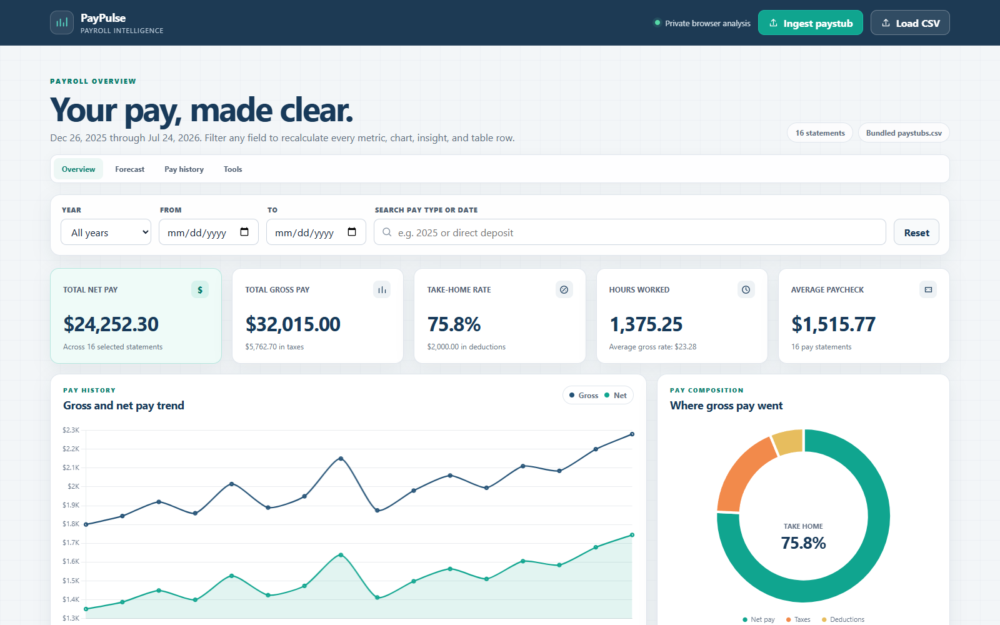
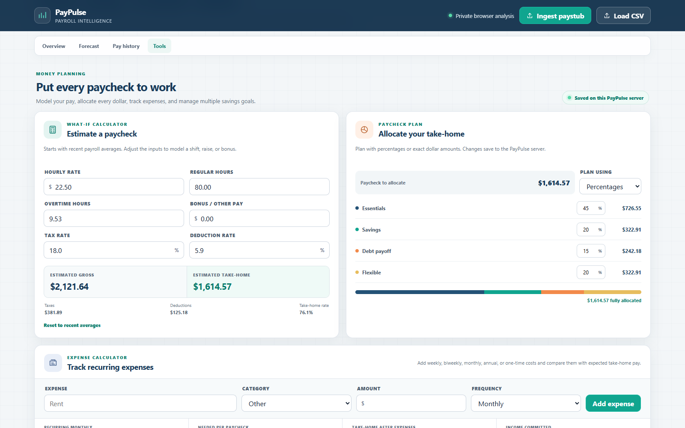
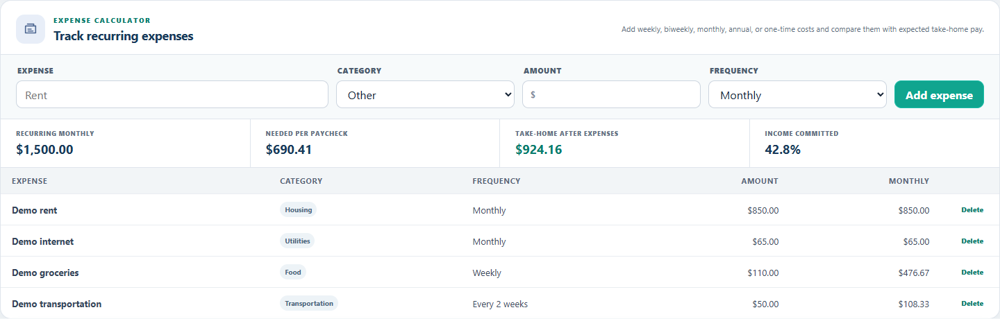
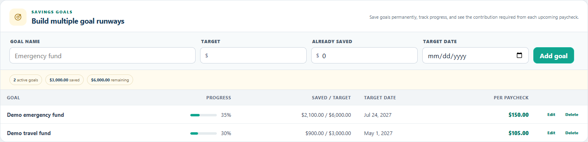
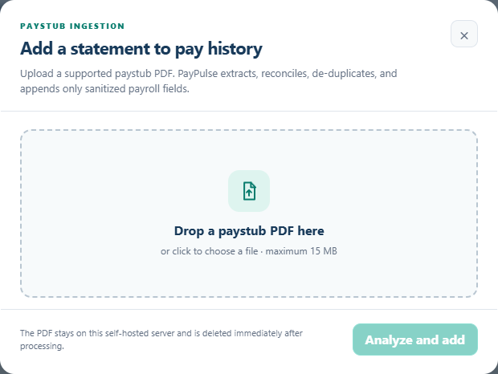
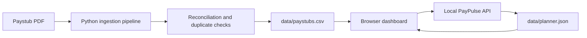

<div align="center">

# PayPulse

### Private, self-hosted payroll intelligence and paycheck planning

Turn sanitized pay history into clear trends, forecasts, expense plans, and savings goals—all without sending financial data to an external service.


</div>

> [!NOTE]
> Every screenshot in this README was generated from fully simulated payroll and planner fixtures. No real employee, paystub, expense, or savings-goal data is shown.



## Overview

PayPulse is a local payroll dashboard for understanding how earnings, taxes, deductions, hours, and take-home pay change over time. It combines an interactive browser experience with a small Python server that handles durable planner storage and privacy-conscious PDF paystub ingestion.

The dashboard ships with a locally bundled copy of Chart.js and makes no external application requests. Payroll records remain in a local CSV, while allocations, expenses, and savings goals are stored in a separate local planner file.

## Highlights

| Area | Capabilities |
| --- | --- |
| **Payroll overview** | Gross and net trends, composition, effective tax rate, recorded hours, average paycheck, and filter-aware KPIs |
| **Forecasting** | Adjustable 3-, 6-, and 12-month projections with conservative, expected, and upside scenarios |
| **Tools** | Paycheck what-if calculator, take-home allocation by percentage or dollar amount, recurring expenses, and savings goals |
| **Data quality** | Reconciliation checks, duplicate signatures, required-field coverage, and unusual pay-cadence detection |
| **History** | Searchable, sortable, paginated pay statements with filtered CSV export |
| **Ingestion** | PDF extraction, reconciliation, duplicate protection, atomic CSV writes, and timestamped backups |
| **Privacy** | Local processing, sanitized fields, no external analytics, and no cloud account requirement |

## Feature tour

### Paycheck modeling and allocation

The Tools workspace starts from recent payroll averages. Model changes to rate, hours, overtime, bonuses, taxes, or deductions, then allocate the resulting take-home pay using percentages or exact dollar amounts.



### Recurring expense planning

Track weekly, biweekly, monthly, annual, and one-time expenses. PayPulse normalizes recurring costs, estimates the amount required from each paycheck, and shows the remaining take-home pay.



### Persistent savings goals

Maintain multiple savings goals with target dates, saved balances, progress indicators, and a recommended contribution per estimated paycheck.



### Reconciled paystub ingestion

Upload a supported PDF statement to extract and append sanitized payroll fields. Temporary source files are deleted immediately after processing.



## Architecture



| Component | Responsibility |
| --- | --- |
| `index.html`, `styles.css`, `app.js` | Responsive interface, filtering, charts, projections, and planning calculations |
| `server.py` | Static hosting, planner API, upload validation, and PDF-ingestion endpoint |
| `ingestion.py` | Paystub extraction, reconciliation, deduplication, backups, and atomic CSV updates |
| `data/paystubs.csv` | Sanitized payroll history used by the dashboard |
| `data/planner.json` | Server-persisted allocations, expenses, and savings goals |
| `vendor/chart.umd.min.js` | Locally bundled Chart.js runtime |

## Quick start

### Requirements

- Python 3.10 or newer
- A modern browser

### Run PayPulse

From the project root:

```powershell
python -m pip install -r requirements.txt
python server.py
```

Open [http://localhost:8000](http://localhost:8000).

The default server binds to `127.0.0.1`, keeping the application available only on the local machine.

## Add payroll data

### From the dashboard

1. Start PayPulse with `python server.py`.
2. Select **Ingest paystub**.
3. Choose or drop a supported PDF.
4. Select **Analyze and add**.

For every supported statement, the ingestion pipeline:

- extracts each recognized statement page;
- excludes employee, company, payment, bank-account, address, and source-document identifiers;
- verifies gross pay against paid earnings;
- verifies tax and deduction component totals;
- verifies `gross − taxes − deductions = net`;
- detects duplicates using pay date, pay period, gross pay, and net pay;
- creates a timestamped backup before modifying the CSV;
- writes changes atomically and deletes the temporary PDF.

### From the command line

```powershell
# Validate a PDF without changing payroll history
python ingestion.py "C:\path\to\paystub.pdf"

# Append reconciled, nonduplicate statements
python ingestion.py "C:\path\to\paystub.pdf" --append
```

The **Load CSV** action can analyze another compatible CSV temporarily in the browser. It does not overwrite the primary payroll history.

## Persistent planning data

The local server validates and atomically writes allocations, expenses, and savings goals to `data/planner.json`. Browser local storage acts only as an offline fallback and first-run migration source.

To use another planner file:

```powershell
python server.py --planner "C:\path\to\planner.json"
```

Planner records are kept separate from payroll history and are never included in payroll exports.

## Configuration

```text
python server.py [--host HOST] [--port PORT] [--csv PATH] [--planner PATH]
```

| Option | Default | Description |
| --- | --- | --- |
| `--host` | `127.0.0.1` | Network interface used by the server |
| `--port` | `8000` | HTTP port |
| `--csv` | `data/paystubs.csv` | Payroll-history CSV |
| `--planner` | `data/planner.json` | Persistent planning document |

`PAY_DASHBOARD_HOST` and `PAY_DASHBOARD_PORT` can also provide the host and port through environment variables.

## Local API

| Method | Endpoint | Purpose |
| --- | --- | --- |
| `GET` | `/api/health` | Reports ingestion and planner availability |
| `GET` | `/api/planner` | Loads validated planning data |
| `PUT` | `/api/planner` | Validates and atomically persists planning data |
| `POST` | `/api/ingest` | Processes and appends an uploaded paystub PDF |

Planner requests are limited to 128 KB. PDF uploads are limited to 15 MB.

## Projection methodology

PayPulse estimates pay cadence from historical pay dates and models gross pay from up to the 12 most recent statements. It caps trend extremes around the recent average, then applies recent tax and deduction ratios to estimate take-home pay. Conservative and upside scenarios adjust the stabilized expected case by 5%.

Projections are planning estimates—not guaranteed income. Future schedules, raises, bonuses, benefit elections, and withholding changes can materially affect results.

## Privacy and security

- Payroll and planning data are not sent to an external application service.
- Chart.js is bundled locally.
- Uploaded PDFs are processed by the self-hosted server and deleted immediately afterward.
- Only sanitized payroll fields are written to the CSV.
- Direct identifiers are excluded from the dashboard and exported views.
- CSV changes and planner updates use atomic writes.
- The server adds `X-Content-Type-Options: nosniff` and a no-referrer policy.

PayPulse does not implement authentication. Keep the default loopback binding unless the application is placed behind appropriate access controls.

## Testing

Run the complete test suite:

```powershell
python -m unittest discover -s tests -v
```

The tests cover statement extraction and reconciliation, duplicate-safe atomic appends, planner validation, invalid-record rejection, and planner persistence round trips.

## Project structure

```text
paypulse/
├── app.js
├── index.html
├── ingestion.py
├── server.py
├── styles.css
├── requirements.txt
├── data/
│   ├── paystubs.csv
│   └── planner.json          # Created after the first planner save
├── docs/
│   └── images/
├── tests/
│   ├── test_ingestion.py
│   └── test_planner.py
└── vendor/
    └── chart.umd.min.js
```
