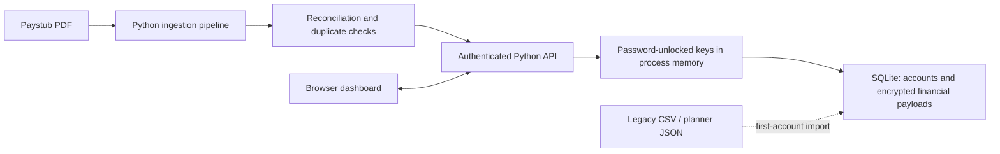

<div align="center">

# PayPulse

### Private, self-hosted payroll intelligence and paycheck planning

Turn sanitized pay history into clear trends, forecasts, expense plans, and savings goals—all without sending financial data to an external service.


</div>

> [!NOTE]
> Every screenshot in this README was generated from fully simulated payroll and planner fixtures. No real employee, paystub, expense, or savings-goal data is shown.


## Overview

PayPulse is a local payroll dashboard for understanding how earnings, taxes, deductions, hours, and take-home pay change over time. It combines an interactive browser experience with a small Python server that handles durable planner storage and privacy-conscious PDF paystub ingestion.

The dashboard ships with a locally bundled copy of Chart.js and makes no external application requests. Accounts and sessions are stored in local SQLite; payroll records, allocations, expenses, and savings goals are stored there as authenticated ciphertext in a password-unlocked financial vault.

## Highlights

| Area | Capabilities |
| --- | --- |
| **Payroll overview** | Gross and net trends, composition, effective tax rate, recorded hours, average paycheck, and filter-aware KPIs |
| **Forecasting** | Adjustable 3-, 6-, and 12-month projections with conservative, expected, and upside scenarios |
| **Tools** | Paycheck what-if calculator, take-home allocation by percentage or dollar amount, recurring expenses, and savings goals |
| **Data quality** | Reconciliation checks, duplicate signatures, required-field coverage, and unusual pay-cadence detection |
| **History** | Searchable, sortable, paginated, inline-editable pay statements with row removal and filtered CSV export |
| **Ingestion** | PDF extraction, reconciliation, duplicate protection, and account-scoped SQLite storage |
| **Accounts** | Local registration, password-unlocked vaults, expiring sessions, owner recovery, CSRF protection, and an admin user panel |
| **Privacy** | AES-256-GCM financial storage, local processing, per-user records, no external analytics, and no cloud account requirement |

## Feature tour

### Paycheck modeling and allocation

The Tools workspace starts from recent payroll averages. Model changes to rate, hours, overtime, bonuses, taxes, or deductions, then allocate the resulting take-home pay using percentages or exact dollar amounts.


### Recurring expense planning

Track weekly, biweekly, monthly, annual, and one-time expenses. PayPulse builds a calendar-month budget using four weekly or two every-two-week increments, estimates the amount required from each paycheck, and shows the remaining take-home pay.


### Persistent savings goals

Maintain multiple savings goals with target dates, saved balances, progress indicators, and a recommended contribution per estimated paycheck.


### Reconciled paystub ingestion

Upload a supported PDF statement to extract and append sanitized payroll fields. Temporary source files are deleted immediately after processing.


### Manual income and deposits

Use **Add income** to record a paystub or a deposit such as VA benefits, Social Security,
a pension, or another income source. Manual records are validated and saved to the signed-in
user's SQLite pay history. Recurring benefit and other-income deposits are converted using
calendar-month increments and added to the income shown in the expense calculator; one-time
deposits remain in pay history without inflating the recurring monthly budget.

## Architecture



| Component | Responsibility |
| --- | --- |
| `index.html`, `styles.css`, `app.js` | Responsive interface, filtering, charts, projections, and planning calculations |
| `server.py` | Static hosting, authenticated APIs, upload validation, and request security |
| `database.py` | SQLite schema, password hashing, sessions, users, planners, and pay statements |
| `ingestion.py` | Paystub extraction, reconciliation, deduplication, backups, and atomic CSV updates |
| `data/paypulse.db` | Generated SQLite database and application source of truth |
| `data/paystubs.csv`, `data/planner.json` | Optional legacy sources imported into the first registered account |
| `vendor/chart.umd.min.js` | Locally bundled Chart.js runtime |

## Quick start

### Requirements

- Python 3.10 or newer
- A modern browser

### Run PayPulse

From the project root:

```powershell
python -m pip install -r requirements.txt
python server.py
```

Open [http://localhost:8000](http://localhost:8000).

Register the first account to become the local administrator. Existing `data/paystubs.csv` and `data/planner.json` records are imported into that first account once. The default server binds to `127.0.0.1`, keeping the application available only on the local machine.

## Add payroll data

### From the dashboard

1. Start PayPulse with `python server.py`.
2. Select **Ingest paystub**.
3. Choose or drop a supported PDF.
4. Select **Analyze and add**.

For every supported statement, the ingestion pipeline:

- extracts each recognized statement page;
- excludes employee, company, payment, bank-account, address, and source-document identifiers;
- verifies gross pay against paid earnings;
- verifies tax and deduction component totals;
- verifies `gross − taxes − deductions = net`;
- detects duplicates using pay date, pay period, gross pay, and net pay;
- saves nonduplicate statements to the signed-in user’s SQLite records;
- deletes the temporary PDF after processing.

### From the command line

```powershell
# Validate a PDF without changing payroll history
python ingestion.py "C:\path\to\paystub.pdf"

# Append reconciled, nonduplicate statements
python ingestion.py "C:\path\to\paystub.pdf" --append
```

The command-line CSV append path remains available for legacy workflows while migration is phased out. The dashboard's **Import CSV** action saves compatible records to the signed-in user's SQLite account and skips duplicate statements.

## Accounts and persistent data

The local server stores each account’s pay statements and validated planner document in `data/paypulse.db`. Each account has a random vault key; AES-256-GCM encrypts every paystub and planner document, scrypt derives the password-wrapping key, and the original owner’s password protects the private recovery key. Password authentication still uses salted PBKDF2-SHA256 hashes. Raw passwords, plaintext vault keys, and raw session tokens are never stored.

Vault keys exist only in server process memory after a password login. Sessions expire after seven days, but restarting the server invalidates every session and requires the password again. State-changing authenticated requests require a CSRF token.

The first registered user becomes an administrator and receives records from the legacy CSV and planner JSON when those files exist. Later accounts start with isolated, empty payroll and planner records. Administrators can create accounts, assign roles, activate or deactivate users, view stored statement counts, and delete users from the Tools workspace.

To use another database or legacy import files:

```powershell
python server.py --database "C:\path\to\paypulse.db" --csv "C:\legacy\paystubs.csv" --planner "C:\legacy\planner.json"
```

Browser local storage is scoped by user and acts only as a planner fallback. Planner records are never included in payroll exports.

## Configuration

```text
python server.py [--host HOST] [--port PORT] [--database PATH] [--csv PATH] [--planner PATH]
```

| Option | Default | Description |
| --- | --- | --- |
| `--host` | `127.0.0.1` | Network interface used by the server |
| `--port` | `8000` | HTTP port |
| `--database` | `data/paypulse.db` | SQLite application database |
| `--csv` | `data/paystubs.csv` | Legacy pay-history import for the first account |
| `--planner` | `data/planner.json` | Legacy planner import for the first account |

`PAY_DASHBOARD_HOST` and `PAY_DASHBOARD_PORT` can also provide the host and port through environment variables.

## Local API

| Method | Endpoint | Purpose |
| --- | --- | --- |
| `GET` | `/api/health` | Reports ingestion and planner availability |
| `GET` | `/api/auth/session` | Restores the current cookie session |
| `POST` | `/api/auth/register` | Creates a local account and session |
| `POST` | `/api/auth/login`, `/api/auth/logout` | Unlocks or ends a vault session |
| `POST` | `/api/auth/password` | Changes a password by rewrapping the vault key |
| `GET` | `/api/paystubs` | Loads the signed-in user’s pay statements |
| `POST` | `/api/paystubs/import` | Saves CSV payroll rows to the signed-in user's records |
| `POST` | `/api/paystubs/manual` | Saves a validated manual paystub or income deposit |
| `PATCH` | `/api/paystubs/{id}` | Updates one signed-in user's pay statement |
| `DELETE` | `/api/paystubs/{id}` | Removes one signed-in user's pay statement |
| `GET`, `PUT` | `/api/planner` | Loads or saves the signed-in user’s planner |
| `POST` | `/api/ingest` | Processes a PDF into the signed-in user’s records |
| `GET`, `POST` | `/api/users` | Lists or creates users as an administrator |
| `PATCH`, `DELETE` | `/api/users/{id}` | Updates or deletes a user as an administrator |
| `POST` | `/api/users/{id}/reset-password` | Resets an encrypted account as the recovery owner |

Planner requests are limited to 128 KB, CSV imports to 4 MB or 10,000 statements, and PDF uploads to 15 MB.

## Projection methodology

PayPulse estimates pay cadence from historical pay dates and models gross pay from up to the 12 most recent statements. It caps trend extremes around the recent average, then applies recent tax and deduction ratios to estimate take-home pay. Conservative and upside scenarios adjust the stabilized expected case by 5%.

Projections are planning estimates—not guaranteed income. Future schedules, raises, bonuses, benefit elections, and withholding changes can materially affect results.

## Privacy and security

- Payroll and planning data are not sent to an external application service.
- Chart.js is bundled locally.
- Uploaded PDFs are processed by the self-hosted server and deleted immediately afterward.
- Only sanitized payroll fields enter the vault; financial payloads are encrypted with AES-256-GCM before SQLite persistence.
- Direct identifiers are excluded from the dashboard and exported views.
- Accounts and records are isolated by database user ID.
- Passwords are salted and hashed with PBKDF2-SHA256.
- Per-user vault keys are password-wrapped with scrypt-derived keys and recovery-wrapped to the owner’s public key.
- Pay dates, duplicate signatures, paystub JSON, expenses, allocations, and savings goals are not stored as plaintext.
- Legacy plaintext rows migrate transactionally on the user’s next login, followed by secure deletion, WAL truncation, and SQLite compaction.
- Session identifiers are hashed in SQLite and sent in `HttpOnly`, `SameSite=Lax` cookies.
- Authenticated writes require a per-session CSRF token.
- The final active administrator cannot be deactivated, demoted, or deleted.
- The server blocks direct HTTP access to the `data` directory and adds `X-Content-Type-Options: nosn` plus a no-referrer policy.

This is encrypted-at-rest protection, not zero-knowledge encryption: the trusted running server decrypts data while servicing an unlocked session, and the recovery owner can reset another user’s password. Theft of SQLite or its backups does not reveal financial values without cracking a user or owner password. A compromised running server can read unlocked data.

Keep the default loopback binding unless you add HTTPS and appropriate network controls for remote access. HTTPS is mandatory when passwords or financial responses cross a network.

## Testing

Run the complete test suite:

```powershell
python -m unittest discover -s tests -v
```

The tests cover statement extraction and reconciliation, duplicate-safe imports, planner validation, password hashing, sessions, per-user planner/paystub isolation, and administrator safeguards.

## Project structure

```text
paypulse/
├── app.js
├── index.html
├── ingestion.py
├── server.py
├── styles.css
├── requirements.txt
├── data/
│   ├── paystubs.csv
│   └── planner.json          # Created after the first planner save
├── docs/
│   └── images/
├── tests/
│   ├── test_ingestion.py
│   └── test_planner.py
└── vendor/
    └── chart.umd.min.js
```
